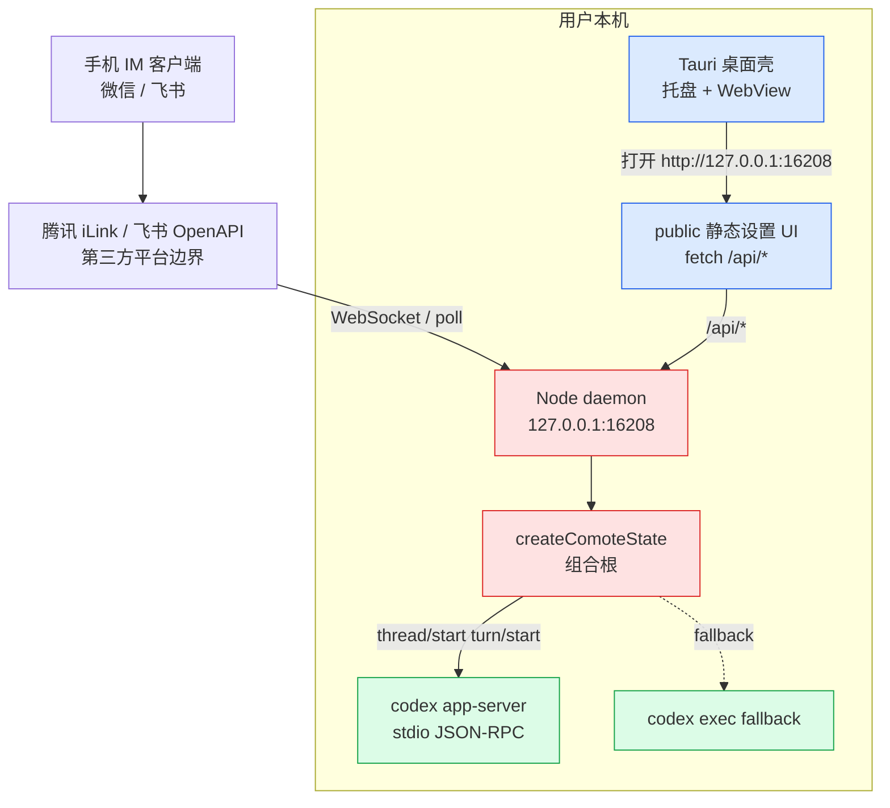
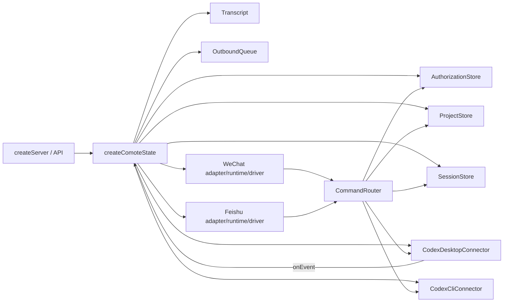

# 01 · 架构总览

> 本章解释 Comote 的运行边界、进程拓扑、目录职责和核心设计取舍。更细的命令状态见 [02 核心模块](./02-核心模块.md)，跨系统时序见 [06 端到端数据流](./06-端到端数据流.md)。

## 01.1 概览

Comote 不是一个云服务，而是跑在用户本机的桥接应用。README 的拓扑把手机、微信 / 飞书 bot、本机 daemon 和 Codex Desktop / CLI 串起来，并明确说明桌面端由 Tauri 包一层壳、Node daemon 作为 sidecar 启动：[`README.md:88`](../README.md#L88)、[`README.md:107`](../README.md#L107)。

本地 daemon 的入口是 [`src/server/index.js`](../src/server/index.js)：它读取端口和持久化路径，默认绑定 `127.0.0.1`，再用 `createPersistentComoteState()` 创建状态对象并交给 HTTP server。端口默认值和本地绑定分别在 [`src/server/index.js:4`](../src/server/index.js#L4) 与 [`src/server/index.js:5`](../src/server/index.js#L5)。

从代码组织看，Comote 的中心不是某个 Web 框架，而是 `src/server/state.js` 的组合根。它实例化核心 store、命令路由、Codex 连接器、双 IM 通道、运行时、队列、事件日志、防休眠和 transcript，并把这些对象挂进 `stateRef` 给 HTTP API 与 runtime 共享：[`src/server/state.js:25`](../src/server/state.js#L25)、[`src/server/state.js:211`](../src/server/state.js#L211)。

## 01.2 进程拓扑

这张图表达“外部 IM 只到通道 driver，本机内部再分成 Tauri 壳、Node daemon 和 Codex app-server”。注意：飞书与微信虽然都经过第三方 IM 服务，但仓库没有自建公网 relay。

Tauri 启动时先探测端口是否已有服务，若没有就启动 `comote-node` sidecar；WebView 打开的不是内嵌前端文件，而是本地 HTTP 地址 [`src-tauri/src/main.rs:25`](../src-tauri/src/main.rs#L25)、[`src-tauri/src/main.rs:36`](../src-tauri/src/main.rs#L36)。这使开发模式和桌面包模式共享同一套 daemon 与 UI API。

## 01.3 目录结构

| 目录 / 文件 | 职责 | 关键证据 |
|---|---|---|
| `src/server/index.js` | Node 进程入口、端口和退出信号 | [`src/server/index.js:7`](../src/server/index.js#L7)、[`src/server/index.js:29`](../src/server/index.js#L29) |
| `src/server/app.js` | HTTP API 与静态资源服务 | [`src/server/app.js:19`](../src/server/app.js#L19)、[`src/server/app.js:382`](../src/server/app.js#L382) |
| `src/server/state.js` | 组合根、事件回流、持久化快照 | [`src/server/state.js:34`](../src/server/state.js#L34)、[`src/server/state.js:265`](../src/server/state.js#L265) |
| `src/core/` | 授权、命令路由、项目、会话、队列、持久化 | [`src/core/commands.js:8`](../src/core/commands.js#L8)、[`src/core/outbound-queue.js:4`](../src/core/outbound-queue.js#L4) |
| `src/channels/` | 微信 / 飞书 adapter、runtime、driver | [`src/channels/wechat/runtime.js:1`](../src/channels/wechat/runtime.js#L1)、[`src/channels/feishu/runtime.js:3`](../src/channels/feishu/runtime.js#L3) |
| `src/connectors/` | Codex Desktop JSON-RPC 与 CLI fallback | [`src/connectors/codex-desktop/index.js:12`](../src/connectors/codex-desktop/index.js#L12)、[`src/connectors/codex-cli/index.js:7`](../src/connectors/codex-cli/index.js#L7) |
| `public/` | 设置 UI、绑定、授权、审批和日志面板 | [`public/app.js:52`](../public/app.js#L52)、[`public/index.html:197`](../public/index.html#L197) |
| `src-tauri/` | 桌面壳、sidecar、bundle 配置 | [`src-tauri/src/main.rs:21`](../src-tauri/src/main.rs#L21)、[`src-tauri/tauri.conf.json:17`](../src-tauri/tauri.conf.json#L17) |
| `scripts/` | sidecar、runtime deps、DMG/NSIS 产物脚本 | [`scripts/build-sidecar.mjs:15`](../scripts/build-sidecar.mjs#L15)、[`scripts/install-prod-deps.mjs:25`](../scripts/install-prod-deps.mjs#L25) |
| `test/` | node:test 契约测试 | [`package.json:18`](../package.json#L18) |

## 01.4 三个核心抽象

第一是 **CommandRouter**。它不是 HTTP router，而是“手机消息 → Codex 操作”的业务路由器。构造函数保存授权、项目、会话、Desktop/CLI connector、transcript，并维护 identity 当前项目、pending 选择、conversation 绑定和 thread 绑定：[`src/core/commands.js:8`](../src/core/commands.js#L8)、[`src/core/commands.js:25`](../src/core/commands.js#L25)。

第二是 **Channel Adapter + Runtime + Driver**。Adapter 负责把平台 payload 标准化并调用命令路由；Runtime 负责长连接 / 轮询、去重、重试和投递队列；Driver 才持有第三方 API 的真实协议。微信三层在 [`src/channels/wechat/adapter.js:5`](../src/channels/wechat/adapter.js#L5)、[`src/channels/wechat/runtime.js:1`](../src/channels/wechat/runtime.js#L1)、[`src/channels/wechat/ilink-driver.js:8`](../src/channels/wechat/ilink-driver.js#L8)。飞书三层在 [`src/channels/feishu/adapter.js:3`](../src/channels/feishu/adapter.js#L3)、[`src/channels/feishu/runtime.js:3`](../src/channels/feishu/runtime.js#L3)、[`src/channels/feishu/driver.js:1`](../src/channels/feishu/driver.js#L1)。

第三是 **CodexDesktopConnector**。它把 Codex app-server 的 JSON-RPC 请求、server request 和 notification 翻译成 Comote 能消费的小事件集：审批、turn started/completed、进度、agent message、错误等，入口在 [`src/connectors/codex-desktop/index.js:139`](../src/connectors/codex-desktop/index.js#L139)。

## 01.5 组合根关系

这里的设计取舍是“少引入框架，把可测试对象显式组装”。`createComoteState()` 接收 `persisted`、`stateStore`、runtime 开关和 `desktopOverride`，这让测试可以替换 Desktop connector 或禁用自动启动：[`src/server/state.js:25`](../src/server/state.js#L25)、[`src/server/state.js:30`](../src/server/state.js#L30)。

## 01.6 关键设计取舍

| 取舍 | 当前实现 | 为什么这样做 | 代价 |
|---|---|---|---|
| 本地 HTTP 而非直接 Tauri IPC | WebView 打开 `http://127.0.0.1:16208` | daemon 可独立开发、测试、打包为 sidecar | HTTP API 必须额外考虑 token 与静态资源边界 |
| Codex Desktop 为主 | `startThread` / `turn/start` 走 app-server | 能保留 Desktop thread 和审批能力 | 依赖 Codex app-server 协议稳定性 |
| IM 通道先入队 | adapter 的 `sendReply` 都 enqueue 到 `OutboundQueue` | 统一去重、重试、持久化 | 不同通道的投递时机不一致 |
| 飞书 live card，微信文本分片 | 飞书有卡片 PATCH，微信走普通文本和 typing | 贴合平台能力差异 | 频道体验不完全一致 |
| Tauri 关闭窗口不退出 | close event 只 hide，退出时才 kill sidecar | 用户离开电脑时手机仍能控制 Codex | 需要托盘和退出菜单解释驻留行为 |

## 01.7 已知缺陷 / 改进建议

| 维度 | 当前 | 建议 |
|---|---|---|
| 文档同步 | README 命令速查少于代码真实命令集 | README 增补 `/use`、`/switch`、`/tail`、`/cancel`，或标明“常用命令” |
| 状态持久化说明 | `EventLog` 注释说不跨重启，但 state 快照会保存 `events` | 统一实现和注释，明确日志是否属于持久化状态 |
| API 架构 | `src/server/app.js` 是手写长 if 路由 | API 面继续变大时拆成路由表，降低误改相邻端点风险 |
| 桌面端口 | Tauri 端口固定 16208 | 后续可从配置读取端口，避免多个用户态实例冲突 |

## 下一步

- 想理解命令如何推进状态 → [02 核心模块](./02-核心模块.md)
- 想理解微信 / 飞书具体差异 → [03 频道与集成层](./03-频道与集成层.md)
- 想理解 Codex app-server 协议 → [04 Codex连接器与模型后端](./04-Codex连接器与模型后端.md)
