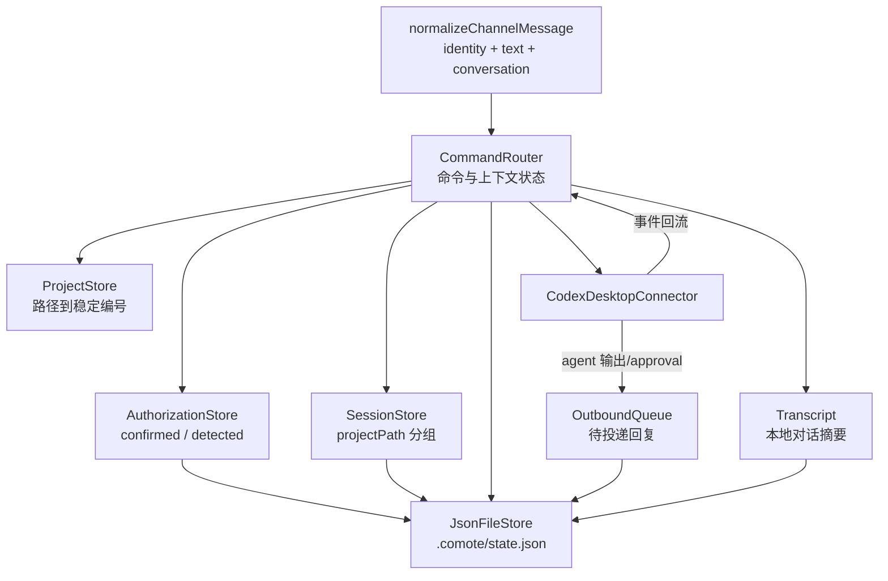
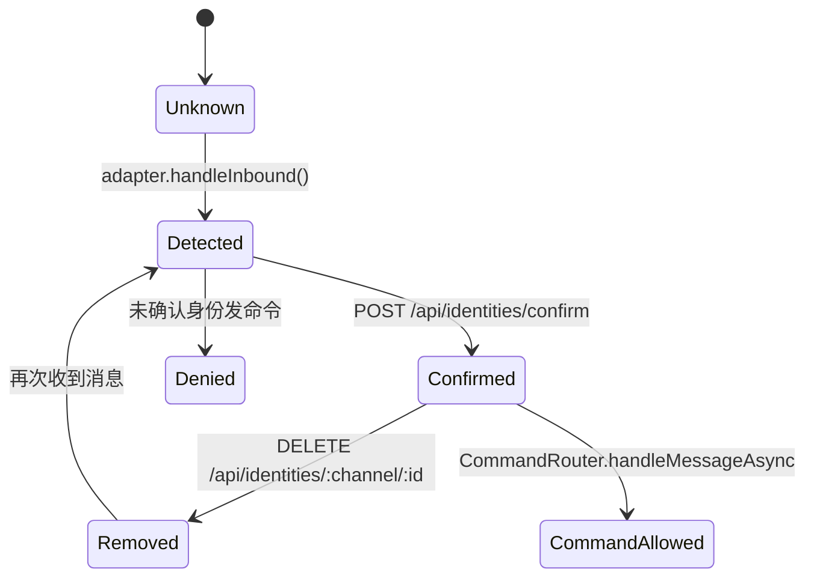
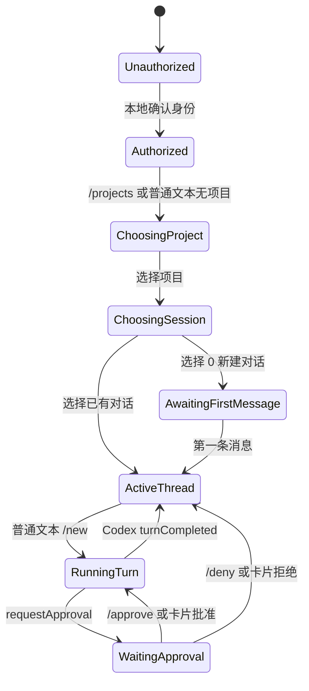

# 02 · 核心模块

> 本章聚焦 `src/core/` 与 `src/server/state.js`：身份、项目、会话、命令路由、回包队列、transcript 和持久化。

## 02.1 概览

Comote 的核心模块围绕一个问题展开：手机上的一条消息，如何在本机安全地定位“哪个身份、哪个项目、哪个 Codex thread”，再把结果发回原聊天。这个问题由 `AuthorizationStore`、`ProjectStore`、`SessionStore`、`CommandRouter`、`OutboundQueue` 和 `Transcript` 分工解决。

`createComoteState()` 是这些对象的装配点。它先从持久化状态恢复 identities、detected identities、sessions、events、transcript，再实例化 Desktop/CLI 连接器和两个通道 adapter/runtime：[`src/server/state.js:34`](../src/server/state.js#L34)、[`src/server/state.js:46`](../src/server/state.js#L46)、[`src/server/state.js:58`](../src/server/state.js#L58)。

## 02.2 核心对象关系

这个结构的关键是 `conversation` 被保留在标准消息模型里。`normalizeChannelMessage()` 不只保存文本，还保存 channel、conversationId、accountId 等返回路径信息，注释直说这些字段用于把 Codex 输出路由回同一个聊天：[`src/core/channel.js:1`](../src/core/channel.js#L1)、[`src/core/channel.js:10`](../src/core/channel.js#L10)。

## 02.3 AuthorizationStore

身份唯一键是 `${channel}:${stableId}`，缺少 channel 或 stableId 会直接抛错：[`src/core/authorization.js:1`](../src/core/authorization.js#L1)。`AuthorizationStore` 内部维护两个 Map：`identities` 表示已确认，`detectedIdentities` 表示见过但未确认：[`src/core/authorization.js:8`](../src/core/authorization.js#L8)。

确认身份时，store 会把 role 默认成 `operator`，加入 confirmed map，并从 detected map 删除：[`src/core/authorization.js:17`](../src/core/authorization.js#L17)。检测身份时，如果尚未确认，就进入 detected map 等桌面 UI 处理：[`src/core/authorization.js:29`](../src/core/authorization.js#L29)。命令路由的异步入口会在授权失败时先发一次说明，之后返回 denied：[`src/core/commands.js:118`](../src/core/commands.js#L118)。

这个模型的安全边界很小：adapter 可以发现身份，但不能授权身份；授权只能通过本地 API 的确认端点完成，端点在 [`src/server/app.js:106`](../src/server/app.js#L106)。

## 02.4 ProjectStore 与 SessionStore

`ProjectStore` 的设计目标是让 `/open 1` 这类编号在刷新后尽量稳定。它以规范化后的 path 为 key，首次见到路径时分配递增 id，后续刷新保留原 id：[`src/core/projects.js:9`](../src/core/projects.js#L9)、[`src/core/projects.js:26`](../src/core/projects.js#L26)。如果用户传绝对路径，`resolveProject()` 会直接返回一个 `source: "direct"` 的临时项目：[`src/core/projects.js:50`](../src/core/projects.js#L50)。

`SessionStore` 按 `projectPath` 分组，维护 `activeByProject`。本地创建 session 用 `session_0001` 这类 id；Codex Desktop 线程会通过 `upsertExternalSession()` 合并成本地 session，并标记 `external: true`：[`src/core/sessions.js:15`](../src/core/sessions.js#L15)、[`src/core/sessions.js:35`](../src/core/sessions.js#L35)。

这种设计让本地 UI 和手机命令可以把“Codex Desktop 已有 thread”和“Comote 本地 fallback session”放进同一个选择流程。`sessionsTextAsync()` 连接 Desktop 时优先调用 `listThreads({cwd})`，否则才读本地 SessionStore：[`src/core/commands.js:393`](../src/core/commands.js#L393)、[`src/core/commands.js:399`](../src/core/commands.js#L399)、[`src/core/commands.js:411`](../src/core/commands.js#L411)。

## 02.5 CommandRouter 状态机

`CommandRouter` 维护四类关键映射：identity 当前项目、pending 选择态、identity 到 conversation、threadId 到 conversation。构造函数和快照方法分别在 [`src/core/commands.js:25`](../src/core/commands.js#L25) 与 [`src/core/commands.js:42`](../src/core/commands.js#L42)。

命令集真实定义在 `helpText()`：`/projects`、`/open`、`/sessions`、`/use`、`/switch`、`/new`、`/current`、`/tail`、`/approve`、`/deny`、`/cancel`、`/status`，见 [`src/core/commands.js:240`](../src/core/commands.js#L240)。异步分发入口会把普通文本送到 `handlePlainText()`，而 `handlePlainText()` 会根据 pending 状态继续选项目、选会话、等待第一条消息，或最终发给 active session：[`src/core/commands.js:136`](../src/core/commands.js#L136)、[`src/core/commands.js:556`](../src/core/commands.js#L556)。

## 02.6 发送到 Codex 的不变量

发送新会话前必须有当前项目；`newSessionAsync()` 会先执行每小时 turn 数限制，再优先创建 Desktop thread 和 start turn：[`src/core/commands.js:518`](../src/core/commands.js#L518)、[`src/core/commands.js:525`](../src/core/commands.js#L525)、[`src/core/commands.js:527`](../src/core/commands.js#L527)。如果 Desktop 不可用而 CLI connector 存在，才 fallback 到 `codex exec`：[`src/core/commands.js:541`](../src/core/commands.js#L541)。

发给已有会话也有同样边界：必须存在 active session，Desktop 必须是 connected，随后会绑定 thread 返回路径、记录用户输入到 transcript、调用 `startTurn()`：[`src/core/commands.js:600`](../src/core/commands.js#L600)、[`src/core/commands.js:606`](../src/core/commands.js#L606)、[`src/core/commands.js:610`](../src/core/commands.js#L610)。

这里的关键不变量是“threadId 必须能找到 conversation”。`bindThreadForIdentity()` 从 `conversationByIdentity` 中取当前聊天，写入 `threadBindings`；回流时 `state.js` 再用 threadId 查回聊天：[`src/core/commands.js:65`](../src/core/commands.js#L65)、[`src/server/state.js:393`](../src/server/state.js#L393)。

## 02.7 OutboundQueue、Transcript 与持久化

`OutboundQueue` 的 `enqueue()` 会根据显式 `dedupeKey` 或 channel/account/conversation/text 生成 dedupe key，重复且未失败的条目会复用旧 entry：[`src/core/outbound-queue.js:12`](../src/core/outbound-queue.js#L12)、[`src/core/outbound-queue.js:97`](../src/core/outbound-queue.js#L97)。失败会增加 attempts，达到 `maxAttempts` 后进入 failed，终态记录最多保留 200 条：[`src/core/outbound-queue.js:60`](../src/core/outbound-queue.js#L60)、[`src/core/outbound-queue.js:79`](../src/core/outbound-queue.js#L79)。

`Transcript` 不是完整事件库，而是按 thread 保存用户和 Codex 最近消息，默认每 thread 50 条、最多 20 个 thread：[`src/core/transcript.js:1`](../src/core/transcript.js#L1)、[`src/core/transcript.js:7`](../src/core/transcript.js#L7)。Codex agent 输出会被 `state.js` 记录进 transcript，再按通道发回：[`src/server/state.js:386`](../src/server/state.js#L386)。

持久化由 `JsonFileStore` 原子写入：先写 `${filePath}.tmp`，再 `rename()` 到目标路径：[`src/core/persistence.js:20`](../src/core/persistence.js#L20)。状态快照包含 identities、detectedIdentities、sessions、outboundReplies、channelConfigs、router、events、transcript、wechatCursor：[`src/server/state.js:219`](../src/server/state.js#L219)。

## 02.8 已知缺陷 / 改进建议

| 维度 | 当前 | 建议 |
|---|---|---|
| 命令帮助一致性 | README 与 `helpText()` 不完全一致 | 以 `helpText()` 生成 README 命令表，或补测试防漂移 |
| 速率限制持久性 | `turnTimestamps` 只在内存中 | 如果要严控成本，可把窗口统计纳入持久化或换成令牌桶 |
| pending 状态 | `pendingByIdentity` 不持久化 | daemon 重启后用户可能需要重新选择项目/会话，可在欢迎消息里提示 |
| 事件日志语义 | 注释说不持久，state 实际保存 events | 修改注释或移除 events 持久化，避免运维误读 |
| CLI fallback | `codex exec` 是一次性输出，不保留 app-server 事件模型 | 在 UI 中明确 Desktop 与 CLI 的能力差异 |

## 下一步

- 想看通道怎么进出队列 → [03 频道与集成层](./03-频道与集成层.md)
- 想看 Codex Desktop 的 JSON-RPC 细节 → [04 Codex连接器与模型后端](./04-Codex连接器与模型后端.md)
- 想看这些对象如何组成端到端流程 → [06 端到端数据流](./06-端到端数据流.md)
