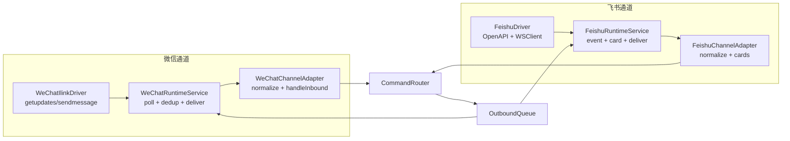
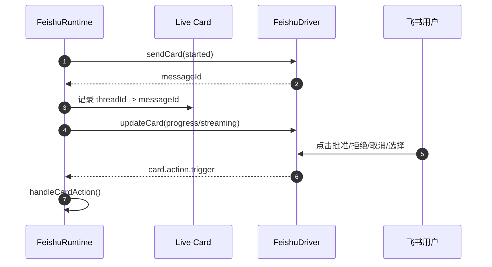

# 03 · 频道与集成层

> 本章讲微信与飞书如何进入 Comote，以及 adapter、runtime、driver 三层为什么分开。Codex 连接器本身见 [04 Codex连接器与模型后端](./04-Codex连接器与模型后端.md)。

## 03.1 概览

Comote 当前有两个手机通道：微信和飞书。它们共享同一套授权与命令路由，但接入方式不同：微信 runtime 通过腾讯 iLink `getupdates` 轮询，飞书 runtime 通过飞书 / Lark OpenAPI WebSocket 接收事件。README 明确当前状态是 WeChat via iLink、Feishu/Lark via official OpenAPI：[`README.md:260`](../README.md#L260)。

代码把每个通道拆成三层。Adapter 负责把平台 payload 归一化为 Comote 消息；Runtime 负责长连接 / 轮询、去重、投递队列和持久化；Driver 封装平台 HTTP/WebSocket 协议。这个分层让业务路由不用理解 open_id、context_token、tenant_access_token 这类平台字段。

## 03.2 通道三层拓扑

微信 adapter 的入口是 `WeChatChannelAdapter`，它在 `normalizeInbound()` 中生成 stable identity、conversation、message 和 attachments：[`src/channels/wechat/adapter.js:5`](../src/channels/wechat/adapter.js#L5)、[`src/channels/wechat/adapter.js:34`](../src/channels/wechat/adapter.js#L34)。飞书 adapter 的 `normalizeInbound()` 从 `event.message` 和 `sender_id` 中取 open_id/user_id、chat_id、chat_type 和文本：[`src/channels/feishu/adapter.js:29`](../src/channels/feishu/adapter.js#L29)。

## 03.3 微信通道

微信通道的 stable identity 是 `wechat:<accountId>:<peerId>`。adapter 把 `accountId` 和 `peerId` 合在 stableId 中，这允许同一台机器绑定多个微信机器人账号时仍能区分同一个外部用户：[`src/channels/wechat/adapter.js:34`](../src/channels/wechat/adapter.js#L34)、[`src/channels/wechat/adapter.js:53`](../src/channels/wechat/adapter.js#L53)。群聊默认禁用，非 direct 会直接返回 ignored：[`src/channels/wechat/adapter.js:63`](../src/channels/wechat/adapter.js#L63)。

`WeChatRuntimeService` 默认每 2.5 秒 poll 一次。为了避免一次 Codex 调用超过 poll 间隔导致并发重入，它有 `polling` guard；同时用 message id 做 bounded dedup，最多保留 1000 个已见 id：[`src/channels/wechat/runtime.js:2`](../src/channels/wechat/runtime.js#L2)、[`src/channels/wechat/runtime.js:20`](../src/channels/wechat/runtime.js#L20)、[`src/channels/wechat/runtime.js:73`](../src/channels/wechat/runtime.js#L73)。

Driver 封装的 iLink API 包括 `getupdates`、`sendmessage`、`sendtyping`、二维码登录和登录状态查询。`getUpdates()` 从响应中抽取 updates 与 cursor；`sendText()` 会从 `dm_<peer>` conversationId 还原目标用户 id：[`src/channels/wechat/ilink-driver.js:37`](../src/channels/wechat/ilink-driver.js#L37)、[`src/channels/wechat/ilink-driver.js:107`](../src/channels/wechat/ilink-driver.js#L107)。登录流程的 QR URL 和 token 状态在 [`src/channels/wechat/ilink-driver.js:144`](../src/channels/wechat/ilink-driver.js#L144) 与 [`src/channels/wechat/ilink-driver.js:162`](../src/channels/wechat/ilink-driver.js#L162)。

## 03.4 飞书通道

飞书 adapter 使用 open_id 或 user_id 作为稳定身份，并默认只处理 p2p。它会尽力通过 injected `resolveDisplayName` 把 open_id 转成人名，但失败时保留 open_id：[`src/channels/feishu/adapter.js:29`](../src/channels/feishu/adapter.js#L29)、[`src/channels/feishu/adapter.js:85`](../src/channels/feishu/adapter.js#L85)。

飞书 runtime 负责三件微信没有的事：校验事件 token、处理 URL verification、维护 live card。事件进入 `handleInbound()` 后先 `verifyEvent()`，再处理 challenge 与去重，然后才交给 adapter 和 `deliverQueued()`：[`src/channels/feishu/runtime.js:119`](../src/channels/feishu/runtime.js#L119)。去重 key 优先 event id，保留 500 个最近事件：[`src/channels/feishu/runtime.js:23`](../src/channels/feishu/runtime.js#L23)。

飞书 driver 通过 tenant access token 调用消息 API。`sendText()` 用 `msg_type: "text"`，`sendCard()` 用 `msg_type: "interactive"`，`updateCard()` 对已有 message 做 PATCH：[`src/channels/feishu/driver.js:52`](../src/channels/feishu/driver.js#L52)、[`src/channels/feishu/driver.js:83`](../src/channels/feishu/driver.js#L83)、[`src/channels/feishu/driver.js:114`](../src/channels/feishu/driver.js#L114)。WebSocket 事件流由 `@larksuiteoapi/node-sdk` 的 `WSClient` 启动：[`src/channels/feishu/driver.js:244`](../src/channels/feishu/driver.js#L244)。

## 03.5 飞书卡片与交互

飞书的体验比微信更丰富，因为卡片支持进度更新、审批按钮、取消按钮和选择按钮。卡片构造函数集中在 `src/channels/feishu/cards.js`，并且是纯函数，没有网络调用或状态：[`src/channels/feishu/cards.js:1`](../src/channels/feishu/cards.js#L1)。长 Markdown 会按 3000 字切分，并处理代码围栏，避免卡片元素过长或代码块断裂：[`src/channels/feishu/cards.js:13`](../src/channels/feishu/cards.js#L13)。

卡片 action 处理在 `handleCardAction()`：approval 会调用 router 的 `resolveApproval()`，然后把原审批卡更新为已处理；pick 操作则后台执行，因为飞书 action callback 只有很短超时窗口：[`src/channels/feishu/runtime.js:258`](../src/channels/feishu/runtime.js#L258)、[`src/channels/feishu/runtime.js:298`](../src/channels/feishu/runtime.js#L298)。

## 03.6 出站队列

两个 adapter 的 `sendReply` 都不是直接打平台 API，而是把 reply 放进同一个 `OutboundQueue`。这在组合根中定义：微信 adapter 的 `sendReply` 调 `outboundReplies.enqueue(reply)`，飞书 adapter 也一样：[`src/server/state.js:71`](../src/server/state.js#L71)、[`src/server/state.js:79`](../src/server/state.js#L79)。

微信 runtime 在 poll loop 的后半段 drain 微信队列并调用 `sendText()`；飞书 runtime 在 inbound 后或 `deliverIfFeishu()` 时主动 drain 队列：[`src/channels/wechat/runtime.js:108`](../src/channels/wechat/runtime.js#L108)、[`src/channels/feishu/runtime.js:139`](../src/channels/feishu/runtime.js#L139)、[`src/server/state.js:503`](../src/server/state.js#L503)。

## 03.7 已知缺陷 / 改进建议

| 维度 | 当前 | 建议 |
|---|---|---|
| 群聊支持 | 微信和飞书默认禁用 group | 设计 mention、权限和 thread 归属后再开放 |
| 微信媒体 | adapter 归一化 attachments，但后续命令路由未使用 | 明确媒体暂不支持，或增加文件/图片转 Codex 输入的策略 |
| 飞书 token 权限 | `resolveUserName()` 需要额外 scope，失败后缓存 null | UI 提示“显示名可能为 open_id”，减少误判 |
| 队列可观测性 | 队列失败只进入 runtime/eventLog | 设置 UI 增加 outbound retrying/failed 面板，便于诊断第三方平台错误 |
| 平台合规 | 微信 iLink 接口风险由用户自行评估 | README 和设置 UI 保持显式风险提示 |

## 下一步

- 想看通道如何把结果发回手机 → [06 端到端数据流](./06-端到端数据流.md)
- 想新增 Telegram/Slack 等通道 → [08 扩展指南](./08-扩展指南.md)
- 想看审批从 Codex 到卡片的来源 → [04 Codex连接器与模型后端](./04-Codex连接器与模型后端.md)
