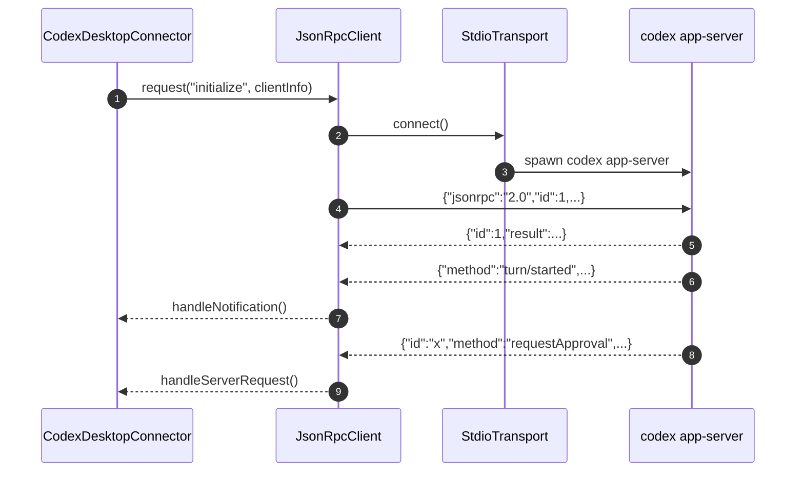
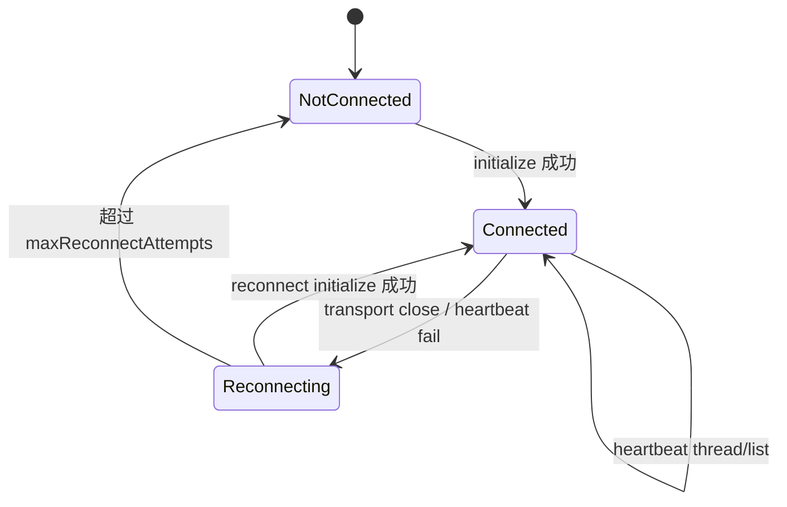
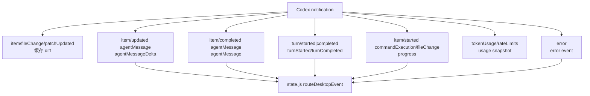
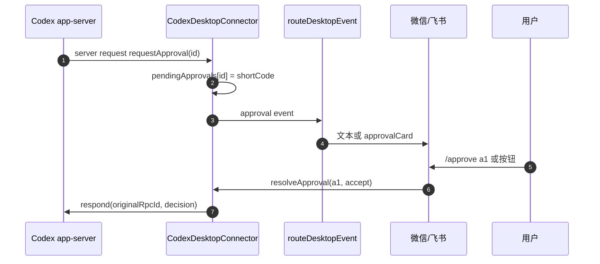

# 04 · Codex 连接器与模型后端

> 本章解释 Comote 怎么与 Codex Desktop app-server 通信，怎么把 JSON-RPC notification 翻译成手机可理解的事件，以及 CLI fallback 的能力边界。

## 04.1 概览

Codex Desktop 是 Comote 的主后端。连接器默认优先使用 `/Applications/Codex.app/Contents/Resources/codex`，否则回退到 PATH 中的 `codex` 命令：[`src/connectors/codex-desktop/index.js:374`](../src/connectors/codex-desktop/index.js#L374)。它启动的是 `codex app-server` 子进程，通过 stdin/stdout 传 newline-delimited JSON-RPC：[`src/connectors/codex-desktop/json-rpc.js:123`](../src/connectors/codex-desktop/json-rpc.js#L123)。

CLI connector 只是备用路径。它执行 `codex exec --skip-git-repo-check -C <cwd> <text>`，拿 stdout/stderr 当一次性输出返回：[`src/connectors/codex-cli/index.js:16`](../src/connectors/codex-cli/index.js#L16)。因此 CLI fallback 没有 Desktop 的 thread event、审批回调和 live progress 模型。

## 04.2 JSON-RPC stdio 模型

`JsonRpcClient.request()` 会先连接 transport，为每个请求分配递增 id，并给 pending 请求设置超时，避免 app-server 半开连接导致调用永久挂住：[`src/connectors/codex-desktop/json-rpc.js:31`](../src/connectors/codex-desktop/json-rpc.js#L31)。响应根据 `id + result/error` settle，server request 根据 `id + method` 分发，notification 根据 `method` 分发：[`src/connectors/codex-desktop/json-rpc.js:76`](../src/connectors/codex-desktop/json-rpc.js#L76)。

`StdioTransport` 负责 spawn 子进程、按行切 JSON、写 stdin 和处理退出。它把 stdout buffer 按换行切成消息，写出时在 JSON 后补 `\n`：[`src/connectors/codex-desktop/json-rpc.js:138`](../src/connectors/codex-desktop/json-rpc.js#L138)、[`src/connectors/codex-desktop/json-rpc.js:149`](../src/connectors/codex-desktop/json-rpc.js#L149)、[`src/connectors/codex-desktop/json-rpc.js:170`](../src/connectors/codex-desktop/json-rpc.js#L170)。

## 04.3 连接可靠性

连接器有重连和心跳。transport close 后，`handleDisconnect()` 把状态改成 reconnecting、停止心跳、发出 `connectionLost`，再指数退避重连；最多 8 次，超过后发 `connectionGaveUp`：[`src/connectors/codex-desktop/index.js:52`](../src/connectors/codex-desktop/index.js#L52)、[`src/connectors/codex-desktop/index.js:64`](../src/connectors/codex-desktop/index.js#L64)。

心跳每 45 秒调用一次 `thread/list`，用来发现操作系统未触发 close 的半开 socket：[`src/connectors/codex-desktop/index.js:88`](../src/connectors/codex-desktop/index.js#L88)。`state.js` 收到连接断开或放弃事件时会释放 SleepGuard，避免 Mac 被错误地持续 caffeinate：[`src/server/state.js:316`](../src/server/state.js#L316)。

## 04.4 Thread 与 Turn RPC

业务 RPC 很薄：`listThreads()` 调 `thread/list`，`startThread()` 调 `thread/start`，`resumeThread()` 调 `thread/resume`，`startTurn()` 调 `turn/start`：[`src/connectors/codex-desktop/index.js:260`](../src/connectors/codex-desktop/index.js#L260)、[`src/connectors/codex-desktop/index.js:305`](../src/connectors/codex-desktop/index.js#L305)、[`src/connectors/codex-desktop/index.js:314`](../src/connectors/codex-desktop/index.js#L314)、[`src/connectors/codex-desktop/index.js:318`](../src/connectors/codex-desktop/index.js#L318)。

两个创建类 RPC 都把 `approvalsReviewer` 设为 `"user"`。这说明 Comote 选择让 Codex 继续向用户请求审批，而不是直接绕过 Codex 的安全模型：[`src/connectors/codex-desktop/index.js:305`](../src/connectors/codex-desktop/index.js#L305)、[`src/connectors/codex-desktop/index.js:318`](../src/connectors/codex-desktop/index.js#L318)。

项目发现优先读取 Codex Desktop 的全局状态文件 `.codex-global-state.json`，拿 active workspace、project order 和 saved workspace roots，失败才从 thread history 推导：[`src/connectors/codex-desktop/index.js:269`](../src/connectors/codex-desktop/index.js#L269)、[`src/connectors/codex-desktop/index.js:380`](../src/connectors/codex-desktop/index.js#L380)。

## 04.5 Notification 翻译

`handleNotification()` 的职责是把 Codex 的 method 名称折叠成更小的事件词汇。它会缓存 fileChange diff，以便后续审批能展示文件变更；会把 agent message delta 和 completed message 分开；会记录 token usage 和 rate limits，但这些只作为 UI 快照，不进入返回消息：[`src/connectors/codex-desktop/index.js:139`](../src/connectors/codex-desktop/index.js#L139)、[`src/connectors/codex-desktop/index.js:185`](../src/connectors/codex-desktop/index.js#L185)。

`state.js` 是这些事件的消费者。`turnStarted` 会获取 SleepGuard、给微信发 typing 或给飞书开 live card；`agentMessage` 会进入 transcript 并按通道转发；`approval` 会转成飞书审批卡或普通文本：[`src/server/state.js:273`](../src/server/state.js#L273)、[`src/server/state.js:386`](../src/server/state.js#L386)、[`src/server/state.js:441`](../src/server/state.js#L441)。

## 04.6 审批协议

审批来自 app-server 的 server request，而不是 notification。连接器用 method 名判断是否审批请求，生成短码 `a1`、`a2`，保存原 rpc id、method、params、threadId 和可能的 changes，然后发出 `approval` 事件：[`src/connectors/codex-desktop/index.js:113`](../src/connectors/codex-desktop/index.js#L113)。

`resolveApproval()` 会把短码映射回原 key，再根据 method 把 accept/decline 转成 Codex 需要的 decision 形状，最后 `client.respond()` 回原 rpc id：[`src/connectors/codex-desktop/index.js:359`](../src/connectors/codex-desktop/index.js#L359)、[`src/connectors/codex-desktop/index.js:416`](../src/connectors/codex-desktop/index.js#L416)。

## 04.7 CLI fallback

CLI fallback 的实现故意很小：`CodexCliConnector.getStatus()` 永远返回 `available`，`runPrompt()` 用 `execFile()` 执行 `codex exec`，maxBuffer 是 8 MiB：[`src/connectors/codex-cli/index.js:7`](../src/connectors/codex-cli/index.js#L7)、[`src/connectors/codex-cli/index.js:16`](../src/connectors/codex-cli/index.js#L16)。

这意味着 fallback 更像“最后能跑一次 prompt”的保险，而不是完整后端。它不会产生 turn/progress/approval 事件，也不会共享 Desktop workspace list。`CommandRouter.newSessionAsync()` 只有在 Desktop 未连接且 CLI connector 存在时走这一支：[`src/core/commands.js:541`](../src/core/commands.js#L541)。

## 04.8 已知缺陷 / 改进建议

| 维度 | 当前 | 建议 |
|---|---|---|
| app-server 协议 | 直接依赖当前 method 名和 payload 形状 | 给 connector 增加协议 fixture 测试，锁住关键 notification/server request |
| usage 展示 | token/rate limit 只保存最近快照 | UI 标注“最近一次”，避免被误解为全局统计 |
| CLI 能力 | CLI fallback 无审批/流式/恢复 | 在返回文案和 UI 中明确降级能力 |
| 取消 turn | 通过 active turn 状态推断 | 若 app-server 提供直接 cancel API，优先使用直接协议 |
| 重连策略 | 固定最多 8 次 | 增加手动重试和最近错误详情，辅助用户定位 Desktop 未启动、路径错误等问题 |

## 下一步

- 想看这些事件如何回到飞书 / 微信 → [06 端到端数据流](./06-端到端数据流.md)
- 想看本地 API 如何暴露审批列表 → [05 Tauri壳与本地安全边界](./05-Tauri壳与本地安全边界.md)
- 想新增另一个 agent 后端 → [08 扩展指南](./08-扩展指南.md)
