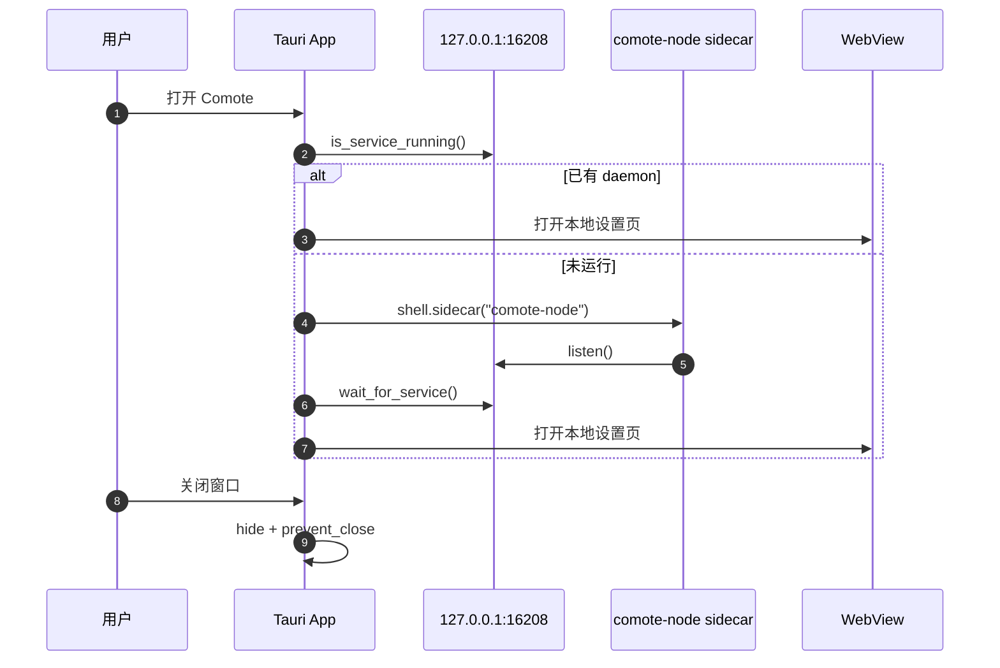
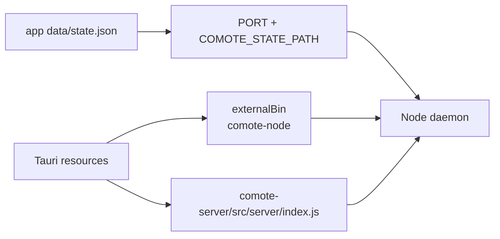
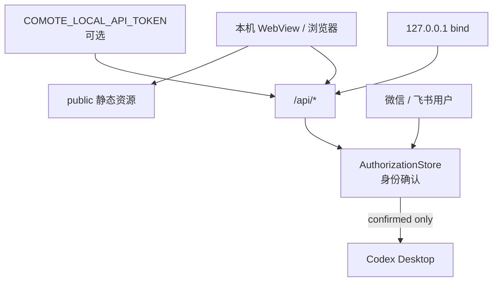

# 05 · Tauri 壳与本地安全边界

> 本章解释桌面壳、sidecar、本地 HTTP API、设置 UI 和安全边界。打包流程见 [07 打包与发布](./07-打包与发布.md)。

## 05.1 概览

Comote 的桌面层不是把所有逻辑写进 Rust，而是用 Tauri 管理窗口、托盘和 sidecar。Rust 壳只负责“确保 Node daemon 在本机跑起来，并把 WebView 指向它”。主要逻辑仍在 Node 侧，这从 Tauri 配置把 `src`、`public`、`package.json` 和 runtime dependencies 都作为资源打包可以看出来：[`src-tauri/tauri.conf.json:21`](../src-tauri/tauri.conf.json#L21)、[`src-tauri/tauri.conf.json:22`](../src-tauri/tauri.conf.json#L22)。

本地安全边界有两层：默认情况下 daemon 绑定 `127.0.0.1`，避免局域网直接访问；如果设置了 `COMOTE_LOCAL_API_TOKEN`，所有 `/api/*` 请求还必须带 `x-comote-token` 或 Bearer token：[`src/server/index.js:5`](../src/server/index.js#L5)、[`src/server/app.js:439`](../src/server/app.js#L439)。

## 05.2 Tauri 启动时序

Tauri setup 固定端口 16208，先检查服务是否存在，不存在才启动 sidecar；sidecar 启动后最多等待 12 秒本地端口可连：[`src-tauri/src/main.rs:25`](../src-tauri/src/main.rs#L25)、[`src-tauri/src/main.rs:26`](../src-tauri/src/main.rs#L26)、[`src-tauri/src/main.rs:133`](../src-tauri/src/main.rs#L133)。WebView 打开外部 URL `http://127.0.0.1:{port}`，窗口默认 1280x800：[`src-tauri/src/main.rs:36`](../src-tauri/src/main.rs#L36)。

关闭窗口不会退出应用。代码拦截 `CloseRequested`，执行 `window.hide()` 并 `prevent_close()`；只有真正 `ExitRequested` 时才 kill sidecar：[`src-tauri/src/main.rs:72`](../src-tauri/src/main.rs#L72)、[`src-tauri/src/main.rs:83`](../src-tauri/src/main.rs#L83)。这是为了保持手机桥接在用户离开电脑后仍可用。

## 05.3 Sidecar 与状态路径

`start_comote_sidecar()` 从 Tauri resource dir 找 `comote-server/src/server/index.js`，从 app data dir 生成 `state.json`，再通过 `tauri-plugin-shell` 的 sidecar 机制启动 `comote-node`：[`src-tauri/src/main.rs:108`](../src-tauri/src/main.rs#L108)、[`src-tauri/src/main.rs:113`](../src-tauri/src/main.rs#L113)、[`src-tauri/src/main.rs:118`](../src-tauri/src/main.rs#L118)。

启动参数和环境变量很少：传入 server entry 参数，设置 `PORT` 和 `COMOTE_STATE_PATH`。这让 packaged app 的状态放在系统 app data，而源码开发时默认是仓库下 `.comote/state.json`：[`src-tauri/src/main.rs:120`](../src-tauri/src/main.rs#L120)、[`src/server/state.js:528`](../src/server/state.js#L528)。

## 05.4 HTTP API 边界

`createServer()` 对 `/api/` 前缀执行本地 token 校验，然后进入 `handleApi()`；非 API 路径走静态资源服务：[`src/server/app.js:19`](../src/server/app.js#L19)。API 面包括状态、版本、日志、身份、项目、会话、Desktop 初始化、threads、transcript、usage、approvals、通道配置、runtime、login、inbound 和 outbound：[`src/server/app.js:40`](../src/server/app.js#L40)、[`src/server/app.js:118`](../src/server/app.js#L118)、[`src/server/app.js:185`](../src/server/app.js#L185)、[`src/server/app.js:209`](../src/server/app.js#L209)。

静态资源服务用 `normalize()` 去掉路径穿越前缀，并检查最终 `filePath` 必须以 `PUBLIC_DIR` 开头；文件流 open 成功后才写 200，避免找不到文件时 headers 已发：[`src/server/app.js:382`](../src/server/app.js#L382)、[`src/server/app.js:388`](../src/server/app.js#L388)、[`src/server/app.js:396`](../src/server/app.js#L396)。

请求 body 限制为 1 MiB。`readJsonBody()` 按 chunk 累加大小，超过就抛 `request body too large`：[`src/server/app.js:364`](../src/server/app.js#L364)。这不是完整的 DoS 防护，但对本机设置 UI 和通道诊断 API 已经足够保守。

## 05.5 设置 UI

`public/app.js` 每 5 秒刷新一次，`renderOnce()` 并发读取 status、identities、candidates、projects、通道配置、runtime、approvals、logs，再单独读取 transcript：[`public/app.js:3`](../public/app.js#L3)、[`public/app.js:52`](../public/app.js#L52)。它会把本地 token 从 `localStorage.comoteApiToken` 放进 `x-comote-token` header：[`public/app.js:5`](../public/app.js#L5)。

UI 的主要职责不是承载 Codex chat，而是做本机控制台：连接状态、授权用户、手机通道绑定、待审批、日志、最近对话和 Codex projects/threads。首页 HTML 的“待审批”区块在 [`public/index.html:197`](../public/index.html#L197)，项目与对话区块在 [`public/index.html:252`](../public/index.html#L252)。

## 05.6 安全边界

这里要区分“本地 API 访问权限”和“手机身份授权”。本地 API token 保护的是设置 UI / API；手机身份授权保护的是谁能通过 IM 操作 Codex。即使 API 未设置 token，未确认的手机身份仍会被 `CommandRouter` 拒绝：[`src/core/commands.js:121`](../src/core/commands.js#L121)。

## 05.7 已知缺陷 / 改进建议

| 维度 | 当前 | 建议 |
|---|---|---|
| API 路由 | 单文件长 if/return | 增加路由表或按 `identities/channels/codex` 拆文件 |
| API token 初始化 | UI 从 localStorage 取 token，但没有统一引导 token 配置流程 | 增加“本机 API token”设置说明与错误恢复 |
| 端口复用 | 端口已有服务时 Tauri 直接复用 | 校验 `/api/status.appName === Comote`，避免误连其他本地服务 |
| CSP | Tauri config 中 `csp: null` | 在 UI 稳定后补 CSP，至少约束脚本来源 |
| 窗口关闭语义 | 关闭即隐藏，对新用户可能不明显 | 托盘菜单或首次关闭提示说明“仍在后台运行” |

## 下一步

- 想看 API 怎么参与完整流程 → [06 端到端数据流](./06-端到端数据流.md)
- 想看 sidecar 如何进入安装包 → [07 打包与发布](./07-打包与发布.md)
- 想新增 API 或 UI 区块 → [08 扩展指南](./08-扩展指南.md)
