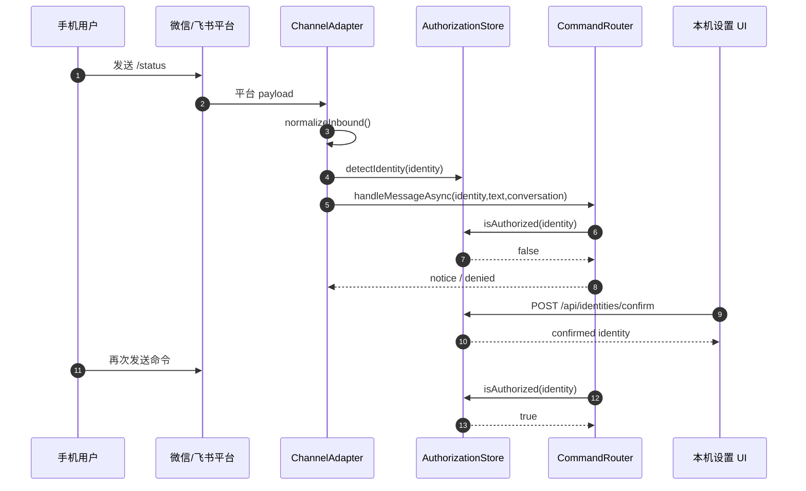
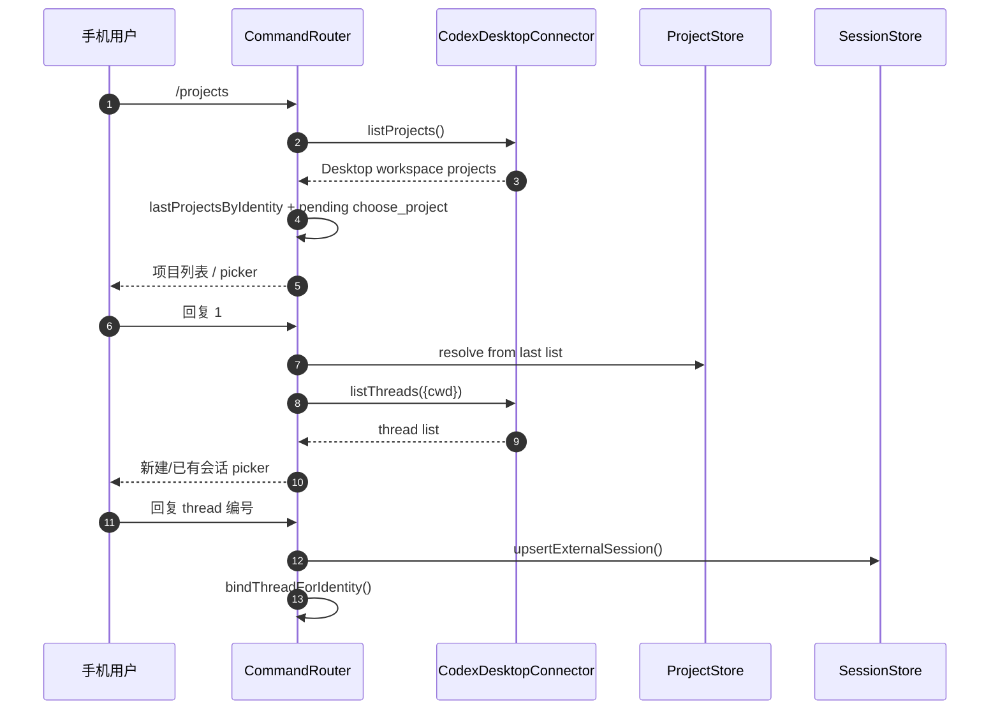
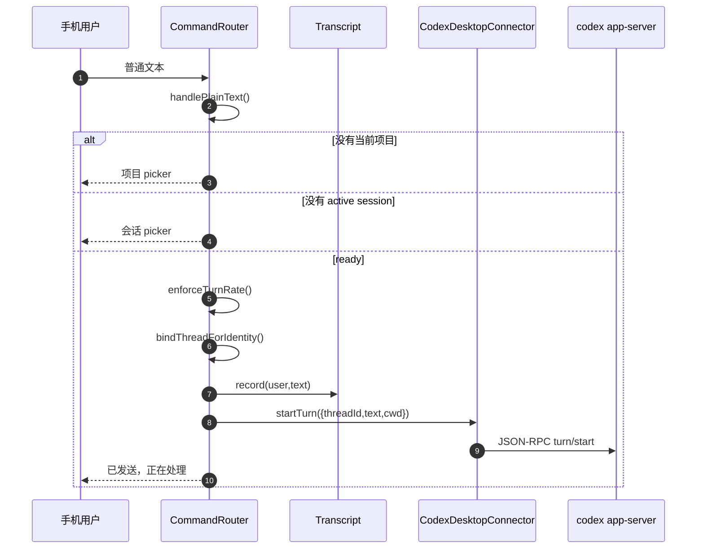
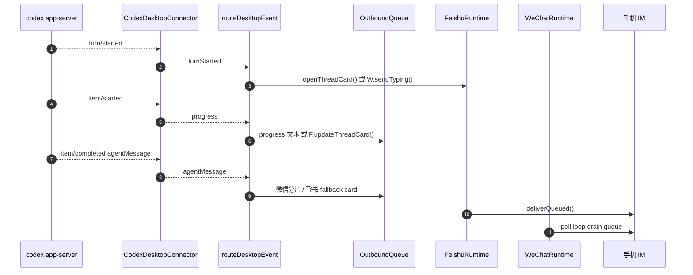
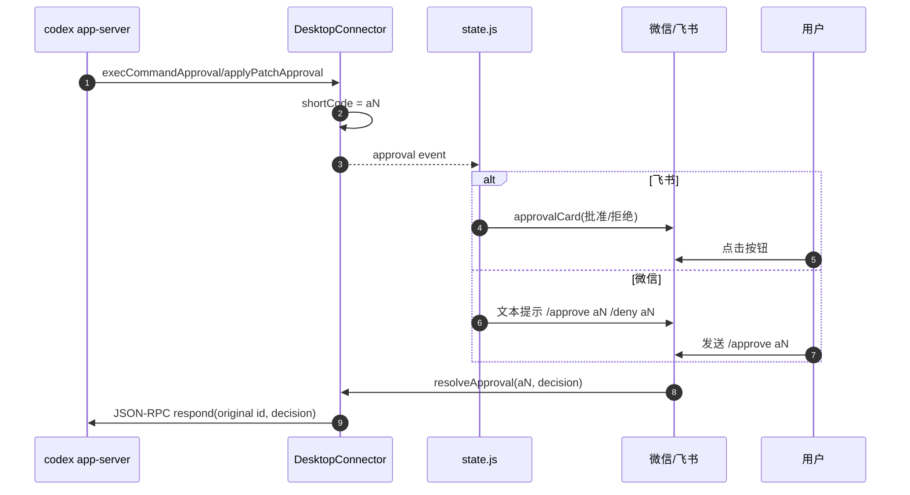

# 06 · 端到端数据流

> 本章用时序图串起最重要的运行场景：首次授权、选择项目 / 会话、发送普通文本、审批、飞书 live card 和通道绑定。

## 06.1 概览

Comote 的端到端流可以概括成两条线：入站线从 IM 平台到 adapter，再到 `CommandRouter`；回流线从 Codex Desktop notification 到 `state.js`，再进入 `OutboundQueue` 或飞书 live card。桥接是否成功，取决于 identity、conversation 和 threadId 三类 key 能否在这两条线之间正确传递。

`conversation` 由 adapter 传给 `CommandRouter`，`threadId -> conversation` 由 `bindThreadForIdentity()` 建立，Codex 事件回流再通过 `getThreadBinding()` 找回原聊天：[`src/core/channel.js:10`](../src/core/channel.js#L10)、[`src/core/commands.js:65`](../src/core/commands.js#L65)、[`src/server/state.js:393`](../src/server/state.js#L393)。

## 06.2 首次消息与授权

微信 adapter 检测身份后调用 `onDetectedIdentity`，再把标准消息交给命令路由：[`src/channels/wechat/adapter.js:72`](../src/channels/wechat/adapter.js#L72)、[`src/channels/wechat/adapter.js:74`](../src/channels/wechat/adapter.js#L74)。飞书 adapter 在处理 inbound 前会尽力解析显示名，也会检测身份：[`src/channels/feishu/adapter.js:60`](../src/channels/feishu/adapter.js#L60)。

未确认身份的行为有两层：第一次会收到说明，后续会被 denied；本机 UI 的确认端点才会把它移入 confirmed map：[`src/core/commands.js:121`](../src/core/commands.js#L121)、[`src/server/app.js:106`](../src/server/app.js#L106)。

## 06.3 项目与会话选择

`projectsTextAsync()` 连接 Desktop 时优先用 `codexDesktop.listProjects()`，然后把项目列表放进 `lastProjectsByIdentity`，把 pending 设置为 `choose_project`：[`src/core/commands.js:279`](../src/core/commands.js#L279)、[`src/core/commands.js:283`](../src/core/commands.js#L283)。`useSessionAsync()` 连接 Desktop 时读取 thread list，选择 thread 后会 resume、upsert external session，并绑定返回路径：[`src/core/commands.js:477`](../src/core/commands.js#L477)、[`src/core/commands.js:489`](../src/core/commands.js#L489)、[`src/core/commands.js:493`](../src/core/commands.js#L493)。

## 06.4 普通文本发送到 Codex

`handlePlainText()` 是“无命令前缀”消息的总入口：它会处理 pending 选择态，否则检查当前项目和 active session，最后调用 `sendToActiveSession()`：[`src/core/commands.js:556`](../src/core/commands.js#L556)、[`src/core/commands.js:577`](../src/core/commands.js#L577)、[`src/core/commands.js:584`](../src/core/commands.js#L584)。

`sendToActiveSession()` 的失败模式很明确：无 active session、Desktop 未连接、thread not found。thread not found 时会尝试 resume 再重发：[`src/core/commands.js:600`](../src/core/commands.js#L600)、[`src/core/commands.js:612`](../src/core/commands.js#L612)、[`src/core/commands.js:618`](../src/core/commands.js#L618)。

## 06.5 Codex 输出回流

`routeDesktopEvent()` 是回流主函数。turn started 获取 SleepGuard、微信 typing 或飞书 started card；progress 对飞书更新 live card，对其他通道最多 20 秒发一次进度文本；agent message 进入 transcript，再按通道投递：[`src/server/state.js:273`](../src/server/state.js#L273)、[`src/server/state.js:332`](../src/server/state.js#L332)、[`src/server/state.js:386`](../src/server/state.js#L386)。

长文本回包会被 `chunkForChannel()` 分成 1500 字一段、最多 6 段，完整内容仍保存在 transcript：[`src/server/state.js:555`](../src/server/state.js#L555)。飞书 live card 则由 `statusCard()` 和 `updateThreadCard()` 处理，避免刷屏：[`src/channels/feishu/cards.js:67`](../src/channels/feishu/cards.js#L67)、[`src/channels/feishu/runtime.js:201`](../src/channels/feishu/runtime.js#L201)。

## 06.6 审批流程

连接器捕获审批请求和缓存短码在 [`src/connectors/codex-desktop/index.js:113`](../src/connectors/codex-desktop/index.js#L113)。`state.js` 将审批转为飞书卡或普通文本，飞书卡按钮定义在 [`src/channels/feishu/cards.js:96`](../src/channels/feishu/cards.js#L96)。最终命令路由的 `/approve` / `/deny` 调 `codexDesktop.resolveApproval()`：[`src/core/commands.js:631`](../src/core/commands.js#L631)。

## 06.7 绑定通道配置

微信和飞书绑定都通过本地 API 驱动。微信 `/api/channels/wechat/login/start` 调 runtime 的 `startLogin()`，轮询 `/login/status` 成功后把 token、accountId、linked user 写入配置并持久化：[`src/server/app.js:249`](../src/server/app.js#L249)、[`src/server/state.js:124`](../src/server/state.js#L124)、[`src/server/state.js:127`](../src/server/state.js#L127)。

飞书绑定类似，但返回的是 appId/appSecret/domain/userId，成功后会更新 driver 并尝试自动启动 WebSocket runtime：[`src/server/app.js:301`](../src/server/app.js#L301)、[`src/server/state.js:164`](../src/server/state.js#L164)、[`src/server/state.js:174`](../src/server/state.js#L174)、[`src/server/state.js:193`](../src/server/state.js#L193)。

## 06.8 已知缺陷 / 改进建议

| 维度 | 当前 | 建议 |
|---|---|---|
| 进度体验 | 微信只做节流文本，飞书有 live card | 在微信支持卡片前，至少给 UI 显示每个 thread 最新状态 |
| 重启恢复 | threadBindings 持久化，但 live card session 不持久化 | daemon 重启中断飞书 live card 后，回流时发 fallback card 已有实现，可在日志中提示 |
| 文本截断 | IM 只发前 6 段，完整内容在本机 transcript | 手机端回复中附“到本机查看完整内容”的固定提示 |
| 绑定错误 | 登录状态由 driver 直接映射，UI 需要理解多种 error | 建立统一 login error code，减少前端分支 |
| 审批上下文 | 文件 diff 依赖之前 fileChange notification 缓存 | 无 changes 时显示 command/reason 已有 fallback，可加“diff 暂不可用”文案 |

## 下一步

- 想看每个核心对象的数据结构 → [02 核心模块](./02-核心模块.md)
- 想看连接器协议细节 → [04 Codex连接器与模型后端](./04-Codex连接器与模型后端.md)
- 想新增一个端到端场景 → [08 扩展指南](./08-扩展指南.md)
