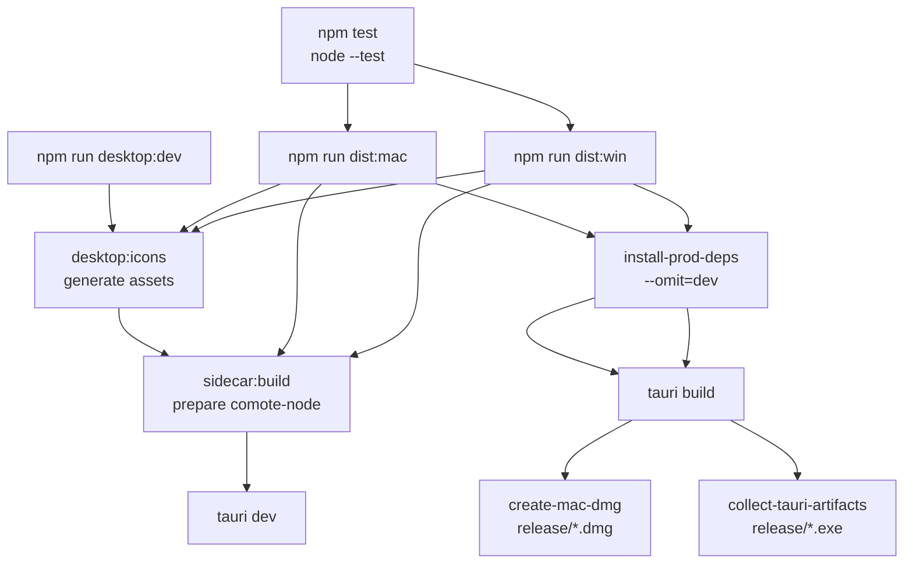
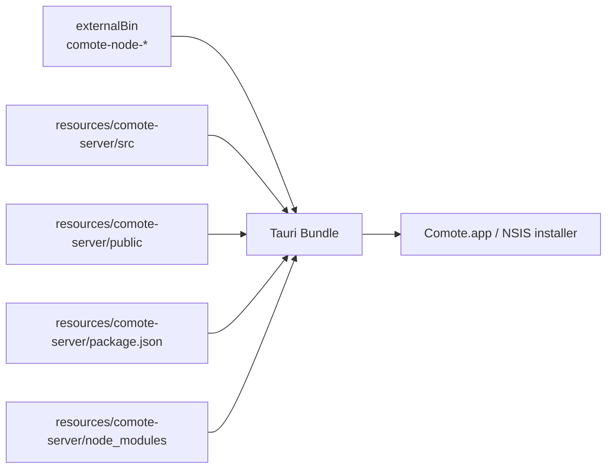
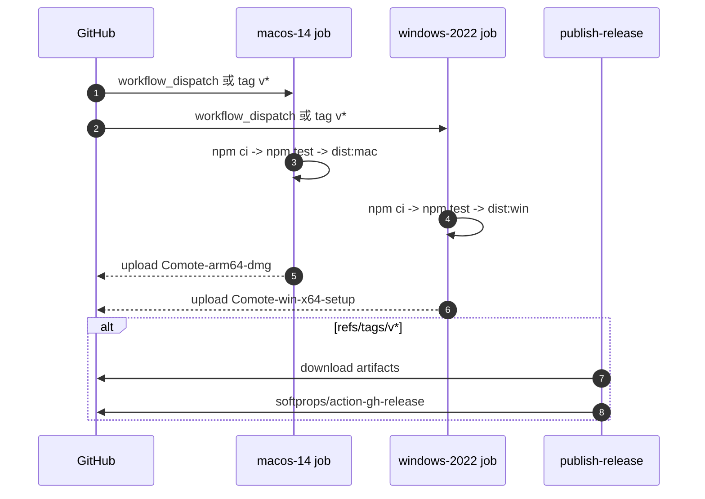

# 07 · 打包与发布

> 本章梳理开发、测试、桌面打包、GitHub Actions 发布和运行时配置。Tauri 生命周期细节见 [05 Tauri壳与本地安全边界](./05-Tauri壳与本地安全边界.md)。

## 07.1 概览

仓库的构建链路由 npm scripts 驱动。`package.json` 标记 `"type": "module"`，要求 Node `>=20`，唯一 devDependency 是 `@tauri-apps/cli`：[`package.json:5`](../package.json#L5)、[`package.json:20`](../package.json#L20)、[`package.json:23`](../package.json#L23)。测试命令是 `node --test`：[`package.json:18`](../package.json#L18)。

桌面开发命令 `desktop:dev` 会先生成图标，再构建当前平台 Node sidecar，最后跑 `tauri dev`：[`package.json:10`](../package.json#L10)。只跑 daemon 则用 `npm run dev`，直接启动 `src/server/index.js`：[`package.json:16`](../package.json#L16)。

## 07.2 构建与发布流水线

macOS 发布命令构建 arm64 sidecar、安装生产依赖、执行 `tauri build --bundles app --target aarch64-apple-darwin`，再调用 DMG 脚本：[`package.json:11`](../package.json#L11)。Windows 命令构建 x64 sidecar、安装生产依赖、执行 NSIS bundle，再收集 exe：[`package.json:12`](../package.json#L12)。

## 07.3 Tauri bundle 组成

Tauri 配置的 bundle target 包括 app、dmg、nsis；外部二进制是 `binaries/comote-node`；资源目录把 Node server、public UI、package.json 和生产 node_modules 放进包里：[`src-tauri/tauri.conf.json:17`](../src-tauri/tauri.conf.json#L17)、[`src-tauri/tauri.conf.json:21`](../src-tauri/tauri.conf.json#L21)、[`src-tauri/tauri.conf.json:22`](../src-tauri/tauri.conf.json#L22)。

`install-prod-deps.mjs` 的存在是为了把生产依赖单独装进 `build-assets/runtime-deps`，避免把 `@tauri-apps/cli` 这类 devDependencies 打进包：[`scripts/install-prod-deps.mjs:1`](../scripts/install-prod-deps.mjs#L1)、[`scripts/install-prod-deps.mjs:11`](../scripts/install-prod-deps.mjs#L11)、[`scripts/install-prod-deps.mjs:25`](../scripts/install-prod-deps.mjs#L25)。

## 07.4 Node sidecar

`scripts/build-sidecar.mjs` 根据 mode 生成或下载 Node runtime。开发模式 `current` 直接复制当前 `process.execPath` 到 `src-tauri/binaries`；macOS arm64 会下载官方 Node runtime；Windows 只能在 Windows 上构建，因为 NSIS 和 sidecar 产物依赖 Windows 工具链：[`scripts/build-sidecar.mjs:15`](../scripts/build-sidecar.mjs#L15)、[`scripts/build-sidecar.mjs:54`](../scripts/build-sidecar.mjs#L54)、[`scripts/build-sidecar.mjs:66`](../scripts/build-sidecar.mjs#L66)。

sidecar 文件名由目标 triple 决定，Windows 追加 `.exe`：[`scripts/build-sidecar.mjs:130`](../scripts/build-sidecar.mjs#L130)。下载 runtime 使用 `curl -L --fail --retry 3`，失败时抛带 URL 的错误：[`scripts/build-sidecar.mjs:112`](../scripts/build-sidecar.mjs#L112)。

## 07.5 产物与 README 漂移

macOS DMG 脚本实际写入 `release/Comote-${version}-arm64.dmg`：[`scripts/create-mac-dmg.mjs:20`](../scripts/create-mac-dmg.mjs#L20)。Windows 收集脚本实际写入 `release/Comote-Setup-${version}-x64.exe`：[`scripts/collect-tauri-artifacts.mjs:14`](../scripts/collect-tauri-artifacts.mjs#L14)。

README 当前写的是 macOS `release/mac/Comote-x.y.z.dmg`、Windows `release/win/`：[`README.md:195`](../README.md#L195)、[`README.md:199`](../README.md#L199)。CI artifact path 也与脚本一致，使用 `release/Comote-*-arm64.dmg` 和 `release/Comote-Setup-*-x64.exe`：[`.github/workflows/desktop-release.yml:28`](../.github/workflows/desktop-release.yml#L28)、[`.github/workflows/desktop-release.yml:46`](../.github/workflows/desktop-release.yml#L46)。因此 README 是需要修正的来源。

## 07.6 CI 与 GitHub Release

workflow 只在手动触发或 `v*` tag push 运行：[` .github/workflows/desktop-release.yml:3`](../.github/workflows/desktop-release.yml#L3)。macOS 和 Windows 两个 job 都先 `npm ci`、`npm test`，再运行各自打包命令：[`.github/workflows/desktop-release.yml:22`](../.github/workflows/desktop-release.yml#L22)、[`.github/workflows/desktop-release.yml:40`](../.github/workflows/desktop-release.yml#L40)。发布 job 只在 tag ref 执行，并用 `softprops/action-gh-release@v2`：[`.github/workflows/desktop-release.yml:49`](../.github/workflows/desktop-release.yml#L49)、[`.github/workflows/desktop-release.yml:64`](../.github/workflows/desktop-release.yml#L64)。

## 07.7 运行时配置

常见环境变量在 README 中列出：`PORT`、`COMOTE_STATE_PATH`、`COMOTE_LOCAL_API_TOKEN`、`COMOTE_WECHAT_ACCOUNT_ID`：[`README.md:118`](../README.md#L118)。代码中还读取飞书配置环境变量：`COMOTE_FEISHU_APP_ID`、`COMOTE_FEISHU_APP_SECRET`、`COMOTE_FEISHU_VERIFICATION_TOKEN`、`COMOTE_FEISHU_ENCRYPT_KEY`、`COMOTE_FEISHU_DOMAIN`：[`src/server/state.js:63`](../src/server/state.js#L63)。

桌面包运行时，Tauri 会把 `COMOTE_STATE_PATH` 指到 app data 下的 `state.json`；源码运行时，默认是 `.comote/state.json`：[`src-tauri/src/main.rs:118`](../src-tauri/src/main.rs#L118)、[`src/server/state.js:528`](../src/server/state.js#L528)。

## 07.8 已知缺陷 / 改进建议

| 维度 | 当前 | 建议 |
|---|---|---|
| README 产物路径 | 与脚本/CI 不一致 | 修正 README，或脚本按 README 建子目录 |
| macOS 架构 | CI 只产 arm64 DMG | 若要支持 Intel Mac，恢复 universal 或 x64 job |
| Linux | sidecar 支持 linux triple，但 Tauri bundle 和 README 未宣称 | 明确“不支持 Linux 桌面包”或补完整发布链 |
| 网络依赖 | sidecar build 下载 Node runtime | 给 CI 缓存 `.comote/node-runtime-cache` 或提供离线失败提示 |
| 依赖审计 | CI 没有 npm audit / cargo audit | 发布前至少增加依赖风险检查，避免桌面包携带已知漏洞 |

## 下一步

- 想改桌面启动或 sidecar 行为 → [05 Tauri壳与本地安全边界](./05-Tauri壳与本地安全边界.md)
- 想新增发布平台 → [08 扩展指南](./08-扩展指南.md)
- 想理解运行时服务为何这样打包 → [01 架构总览](./01-架构总览.md)
