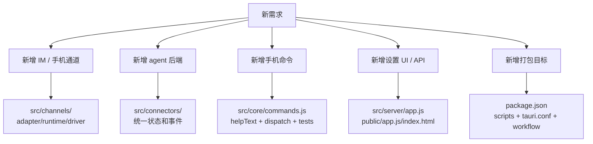
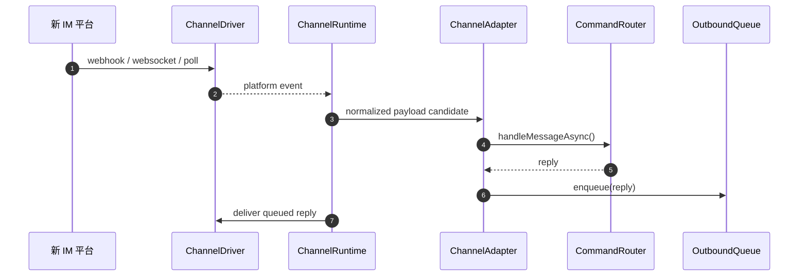

# 08 · 扩展指南

> 本章给后续改代码的落点：新增频道、后端连接器、命令、API/UI、打包目标时应该改哪些文件、守哪些不变量。

## 08.1 概览

Comote 的扩展点主要有四类：手机频道、Codex/agent 后端、命令路由、本地设置 UI。现有代码没有插件加载器，所有扩展都是显式注册到 `createComoteState()`、HTTP API 或 Tauri 打包脚本中。因此扩展时要优先保持小接口，而不是引入隐式约定。

新增任何能力都应先判断它属于哪条链路：入站通道改 `src/channels`；Codex 协议改 `src/connectors`；用户命令改 `src/core/commands.js`；设置界面改 `src/server/app.js` + `public/app.js` + `public/index.html`；打包改 `package.json`、`src-tauri/tauri.conf.json`、`scripts/` 和 workflow。

## 08.2 扩展决策图

## 08.3 新增手机频道

新增频道时建议按微信 / 飞书的三层复制：adapter 只做 payload 归一化和 `commandRouter.handleMessageAsync()`；runtime 管理拉取/订阅、去重、队列投递；driver 封装第三方 API。微信 adapter 和 runtime 的边界可参考 [`src/channels/wechat/adapter.js:63`](../src/channels/wechat/adapter.js#L63)、[`src/channels/wechat/runtime.js:73`](../src/channels/wechat/runtime.js#L73)。飞书的卡片交互可参考 [`src/channels/feishu/runtime.js:258`](../src/channels/feishu/runtime.js#L258)。

必须注册到 `createComoteState()`，并让 `sendReply` 进入 `OutboundQueue`。现有微信和飞书 adapter 都在组合根里传入 `commandRouter`、`onDetectedIdentity` 和 `sendReply`：[`src/server/state.js:71`](../src/server/state.js#L71)、[`src/server/state.js:79`](../src/server/state.js#L79)。如果新通道需要 UI 配置，还要增加 config normalization、公有 config 过滤和 runtime API。

测试要覆盖：未授权身份、direct/group 策略、payload 归一化、重复事件去重、投递失败重试、配置持久化。现有通道测试分布在 `test/wechat-*.test.js` 和 `test/feishu-*.test.js`，可按同一颗粒度新增。

## 08.4 新增 Codex / Agent 后端

新增后端不要直接修改 `CommandRouter` 到处判断协议，先做一个 connector 类，提供与现有 Desktop connector 相近的方法：`getStatus()`、`listProjects()`、`listThreads()`、`startThread()`、`resumeThread()`、`startTurn()`、`cancelTurn()`、`resolveApproval()`。现有 Desktop connector 的方法面在 [`src/connectors/codex-desktop/index.js:210`](../src/connectors/codex-desktop/index.js#L210)、[`src/connectors/codex-desktop/index.js:260`](../src/connectors/codex-desktop/index.js#L260)、[`src/connectors/codex-desktop/index.js:305`](../src/connectors/codex-desktop/index.js#L305)。

如果后端能产生异步事件，建议继续把事件折叠成 `turnStarted`、`turnCompleted`、`progress`、`agentMessageDelta`、`agentMessage`、`approval`、`error` 这些小事件，因为 `state.js` 已经围绕这些事件写了回流逻辑：[`src/server/state.js:273`](../src/server/state.js#L273)。这比把平台原始事件泄漏到通道层更容易测试。

CLI fallback 的简单实现说明了最低能力边界：能执行 prompt、返回一次性输出即可，但没有 thread/progress/approval：[`src/connectors/codex-cli/index.js:7`](../src/connectors/codex-cli/index.js#L7)。如果新增的是完整后端，不要照 CLI 的能力定义做。

## 08.5 新增手机命令

命令路由的入口集中在 `dispatchAuthorizedMessage()` 和旧同步 `handleMessage()`。新增命令时至少改三处：`helpText()` 的帮助文本、异步分发分支、对应业务方法；如果同步路径仍需要支持，也要补 `handleMessage()`：[`src/core/commands.js:79`](../src/core/commands.js#L79)、[`src/core/commands.js:136`](../src/core/commands.js#L136)、[`src/core/commands.js:240`](../src/core/commands.js#L240)。

普通文本路径不要破坏 pending 状态机。`handlePlainText()` 先消费 `choose_project`、`choose_session`、`await_new_session_message`，再检查项目和 active session：[`src/core/commands.js:556`](../src/core/commands.js#L556)。新命令如果会进入多步交互，应把 pending type 写清楚，并决定是否需要持久化。

建议每个新命令至少补测试：未授权行为、缺少参数、成功路径、Desktop 未连接、相关状态持久化。现有命令测试已经覆盖了核心路径，可参考 `test/commands.test.js` 和 `test/commands-extended.test.js`。

## 08.6 新增本地 API 与 UI

API 现在是手写路由。新增端点时把读写边界想清楚：所有 `/api/*` 都会经过 token 校验，但静态资源不会；请求体上限是 1 MiB；写操作通常需要 `await state.persist?.()`：[`src/server/app.js:22`](../src/server/app.js#L22)、[`src/server/app.js:364`](../src/server/app.js#L364)、[`src/server/app.js:106`](../src/server/app.js#L106)。

前端 `renderOnce()` 已经集中并发读取所有主要数据，新面板通常要新增一个 `safeGet()`、一个 render 函数、一个 HTML section 和必要的事件监听：[`public/app.js:52`](../public/app.js#L52)、[`public/app.js:117`](../public/app.js#L117)。如果端点受 `COMOTE_LOCAL_API_TOKEN` 保护，前端请求会自动带 `x-comote-token`：[`public/app.js:5`](../public/app.js#L5)。

新增 UI 不要把业务逻辑放到前端。前端应只是展示状态和触发本地 API；授权、绑定、审批等状态改变必须落在 `state.js` 或 core 类中，保证 node:test 可覆盖。

## 08.7 新增打包目标或发布流程

打包链路需要同时更新 npm scripts、sidecar 构建、Tauri bundle 配置和 CI。sidecar 脚本当前支持 current、mac arm64/universal、Windows x64，Linux 只在 `currentTargetTriple()` 中有开发 triple，不代表完整桌面发布支持：[`scripts/build-sidecar.mjs:15`](../scripts/build-sidecar.mjs#L15)、[`scripts/build-sidecar.mjs:135`](../scripts/build-sidecar.mjs#L135)。

新增平台时要确认三件事：Node runtime 如何进入 `src-tauri/binaries`；Tauri bundle 是否支持目标安装包；产物如何收集到 `release/` 并上传 artifact。现有 artifact 收集只区分 mac 和 win：[`scripts/collect-tauri-artifacts.mjs:9`](../scripts/collect-tauri-artifacts.mjs#L9)。CI 目前也只有 macOS 和 Windows 两个 job：[`.github/workflows/desktop-release.yml:13`](../.github/workflows/desktop-release.yml#L13)、[`.github/workflows/desktop-release.yml:31`](../.github/workflows/desktop-release.yml#L31)。

## 08.8 改动前检查清单

| 改动类型 | 必看文件 | 必补验证 |
|---|---|---|
| 新频道 | `src/channels/*`、`src/server/state.js`、`src/server/app.js` | adapter normalize、runtime 去重、queue deliver、配置持久化 |
| 新连接器 | `src/connectors/*`、`src/core/commands.js`、`src/server/state.js` | startThread/startTurn、event 翻译、approval、断连 |
| 新命令 | `src/core/commands.js`、README 命令表 | 参数错误、未授权、Desktop 离线、多步 pending |
| 新 UI | `src/server/app.js`、`public/app.js`、`public/index.html` | API token、render fallback、写操作 persist |
| 新发版目标 | `package.json`、`scripts/*`、`src-tauri/tauri.conf.json`、workflow | npm test、sidecar 存在、artifact 路径、安装包可启动 |

## 08.9 已知缺陷 / 改进建议

| 维度 | 当前 | 建议 |
|---|---|---|
| 插件化 | 所有扩展都要改组合根 | 在频道数量增加后，引入轻量 channel registry |
| 测试模板 | 没有统一 scaffold | 为新 channel / connector 提供测试模板和 fake driver |
| API 拆分 | `app.js` 越来越长 | 扩展前先拆出 route helper，避免未来冲突 |
| 文档同步 | README、代码、wiki 可能漂移 | 让 `helpText()`、package scripts、产物路径进入自动文档检查 |
| 安全审查 | 新通道容易扩大信任边界 | 新增通道必须写“身份、授权、投递、日志、密钥存储”小节 |

## 下一步

- 改频道前回看 [03 频道与集成层](./03-频道与集成层.md)
- 改连接器前回看 [04 Codex连接器与模型后端](./04-Codex连接器与模型后端.md)
- 改发布流程前回看 [07 打包与发布](./07-打包与发布.md)
